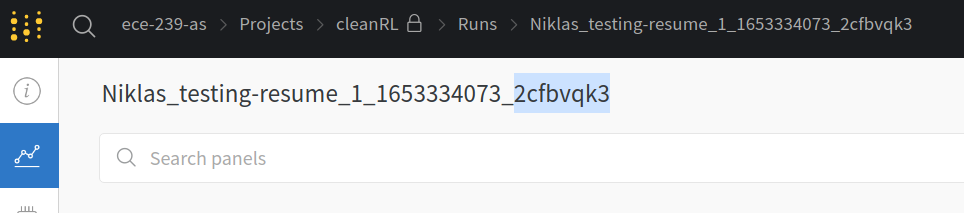

## Getting Started 
- Read the original paper's [README.md](doc/OLD_README.md).
- Install dependencies with `pip install -r requirements.txt`

## Running
We checkpoint our agents' states and performance using [Weights and Biases](https://wandb.ai/). Using it, you can resume any past training run, including those of other team-members. When you run want to run an experiment make sure to consider the following flags:
```
--prod-mode # toggle to store models and progress on cloud.
--exp-name <some_name> # set to identify a particular model or training config.
--gym-id <your_name> # set to identify a person
--resume <run_id> # set if you want to resume an interrupted training run.
```

So for example:
```python ppo_diverse_impala.py  --exp-name testing-resume --gym-id Niklas --resume 2cfbvqk3```

The `run_id` can be seen in the run STDOUT:
```
Running experiment 'Niklas_testing-resume_1_1653334453_2cfbvqk3'
```

and the Weights and Biases UI:



